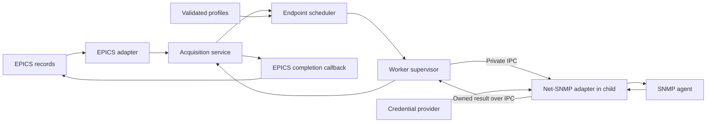

# Extensible SNMP Architecture

## Scope

This proposal separates EPICS record completion from acquisition scheduling
and SNMP security/session management. It targets maintainable SNMPv3 evolution,
including algorithm changes, credential activation at IOC startup and device
recovery. Security profile, credential and engine identity changes require IOC
process restart.
The current implementation is described in [SnmpRequest](snmp-request.md).
The [canonical milestone](milestone-db9ebf5.md#m8---extensible-snmpv3-architecture)
owns implementation ordering, acceptance, test cases and observed results.
The components below are proposed contracts, not existing APIs.

Net-SNMP's documented, version-verified facilities are the implementation
default. The module adds EPICS semantics and application policy; it does not
duplicate a protocol/security facility because an internal abstraction would
be convenient. An exported symbol is evidence of availability, not by itself
a stability, thread-safety, or interoperability guarantee.

**Out of scope:** changed output semantics, an all-record fanout barrier,
automatic security downgrade, proprietary cryptography, firmware updates,
production rollout, live credential/profile replacement and changing PVA schemas.
Additional SNMP security models may fit behind the backend boundary later; this
proposal initially covers USM.

## Required Behavior

For each supported request-driven input, preserve request acceptance,
matching response or terminal error, result/conversion/alarm processing,
FLNK, and then PACT clear. Base explicitly separates the initial asynchronous
return from completion [1]. Fanout visits local passive links in order [2];
the asynchronous return rule in [1] means it does not await a target's
asynchronous completion. A serial dependency
therefore belongs in the source record's FLNK chain.

An idle request-driven input generates no application GET. Discovery and
recovery traffic are separate, bounded control operations. A successful
unchanged value still completes; an error retains the old value and marks it
invalid. No component treats a legacy cache update as a new request's success.

The existing Snmp DTYP, polling behavior, record conversions, INP syntax and
output behavior remain compatibility contracts. SnmpRequest remains opt-in
for ai, longin and stringin. Modernization must not silently migrate a site to
a different protocol, user, algorithm, security level, or SET retry policy.

The [worker watchdog policy](decisions/ADR-20260923-worker-watchdog-policy.md)
preserves effective native timeout/retry settings. An omitted watchdog setting
uses a compatible finite bound derived from those settings and bounded native
control operations; it does not impose a fixed 10-second default.

## Components And Ownership

| Component | Owns | Boundary |
| --- | --- | --- |
| EPICS adapter | Record binding, PACT, Base callback, conversion and alarm mapping | Exchanges typed requests/results; contains no USM keys or Net-SNMP sessions. |
| Acquisition service | Request generation, absolute deadline, terminal-result arbitration, bounded admission and batch membership | Has no dbCommon pointers or Net-SNMP structures; delivers one immutable result to an opaque completion handle. |
| Endpoint scheduler | Endpoint admission, batching, fairness and retry budgets | Uses validated profile identity; schedules application requests separately from discovery/recovery. |
| Configuration and security profiles | Validated immutable endpoint/security descriptions and capability policy | Parser syntax is independent of the backend's C structures. |
| Credential provider | Secret input references, credential revision and input-buffer retirement | Supplies credentials to Net-SNMP; creates no parallel localized-key cache or USM database. |
| Worker supervisor | Child lifecycle, private IPC, worker epoch and transport progress deadline | Never calls Net-SNMP or enters record processing; isolates blocked library calls by configured transport address. |
| Net-SNMP adapter | Library handles, callback context and mapping to owned results | Calls library transport, PDU and USM facilities; never processes an EPICS record or implements cryptography. |
| Diagnostics | Bounded trace, counters and latency/resource observations | Reads snapshots without taking record or transport locks. |



Keep this in the existing module initially. Net-SNMP is the selected protocol
library; a thin boundary isolates its version-specific API and ownership from
records. A generic plugin framework or replacement SNMP stack is not required.
The worker-process runtime below is the recommended proposal supported by the
native-library experiment recorded in M8. Its IPC and IOC integration are not
implemented or verified; adoption remains a design-review decision.

## Request And Result Contract

A request contains an immutable binding ID, record generation, profile
revision, operation, OID, result capacity and absolute monotonic deadline.
Record pointers stay inside the EPICS adapter. A result owns its bytes and
typed value; it cannot reference a freed PDU, session buffer or mutable cache.
Preserve INTEGER signedness, unsigned counter types, lengths and octets until
the adapter applies the existing record conversion rules. Reject overflow
instead of narrowing silently. Legacy text masks are a compatibility view,
not the backend's universal value representation.

A transaction carries an opaque identity plus session and profile revisions.
The library request ID alone is insufficient across reopen or ID reuse.
Binding/profile revisions remain immutable within an IOC process. Batch
membership freezes when the scheduler hands the transaction to the backend,
before any asynchronous send can complete. Later
requests wait for a later transaction, even if their OID matches.

One state transition arbitrates success, failure, deadline and cancellation:

```text
Accepted -> Queued -> Dispatched -> Terminal -> CompletionPending -> Retired
                \--------------------^
```

Queued requests may expire without transmission. Each accepted request gets
one terminal result. Callback queue pressure retains CompletionPending and
retries delivery without repeating I/O. Record generations prevent a retired
response from satisfying a later processing pass. IOC shutdown abandons pending
work through an explicit shutdown disposition and does not synthesize FLNK.

One preallocated request/result slot per registered input bounds the normal
path. If admission is full, complete that attempt as an explicit record error;
do not leave PACT set with no completion owner. Bound session, batch, retry and
diagnostic storage separately. A late network response may release transport
resources after record timeout, but cannot change the terminal result.

## Security Configuration

Separate named endpoint definitions from reusable security profiles. Endpoint
definitions contain address/transport, timeout/retry policy, batch limits,
optional securityEngineID/contextEngineID settings and profile binding. A reusable
USM profile contains securityName, securityLevel, exact authentication/privacy
protocol identifiers, contextName and credential reference. Engine identity
settings belong to the endpoint so a security profile can serve multiple agents.
The immutable binding identifies the endpoint and complete profile revision.

Existing iocsh setters and config-file tokens map through one compatibility
parser. Keep existing record links valid. The additive syntax below selects
named endpoints explicitly; the existing community field is not reinterpreted
as a profile name.

Configure endpoints and profiles before loading their records. Parse a complete
startup candidate, validate it, then publish atomically. Reject
unknown algorithms, unsupported combinations, missing keys, truncation and
derivation errors before application requests. Invalid startup configuration
fails the affected binding explicitly. Security profile, credential and engine
settings freeze when the endpoint's records are initialized; reject subsequent
changes to that binding and reject all such configuration calls after iocInit.
Recovery never rereads configuration or secret files. Diagnostics identify the
field and profile without echoing secrets or raw credential-bearing lines.

Resolve algorithm names, types and OIDs with Net-SNMP's own lookup helpers.
The module retains only validated profile selection and site-policy filtering,
not a second table of protocol OIDs, key lengths or crypto implementations. Include
HMAC-SHA-2 protocols from RFC 7860 [3]; propose authPriv with SHA-256
authentication and AES-128 privacy from RFC 3826 [4] as the new-profile baseline,
conditional on site policy and measured device support. Retain explicitly selected legacy
combinations where policy permits. No automatic fallback occurs. AES-192/256
vendor variants are separate capabilities requiring exact protocol and key
extension identification; an AES label alone is insufficient.

Capability reporting distinguishes implemented, linked-library available,
policy allowed and device verified. Header symbols do not establish that the
linked crypto provider accepts an algorithm. A profile never silently negotiates
down to a weaker protocol or security level. Operator-selected noAuthNoPriv and
authNoPriv remain distinct explicit configurations, not recovery modes.

### Named Profile And Endpoint Syntax

The proposed public commands are additive. They return zero on success and a
nonzero configuration status on failure; the iocsh wrapper must propagate the
error. A failed definition is never published and never falls back to a legacy
host binding.

| Command | Contract |
| --- | --- |
| devSnmpLoadV3Profile(name, filename) | Validate syntax and credential-file input for one immutable USM profile. Native capability/key validation follows in the endpoint worker before binding succeeds. Duplicate names are errors, including before record loading. |
| devSnmpDefineEndpoint(name, address, profile) | Define one v3 endpoint using an existing named profile and a Net-SNMP transport address. Duplicate names and unknown profiles are errors. |
| devSnmpSetEndpointParam(name, parameter, value) | Set timeoutMSec, retries, maxOidsPerReq, securityEngineID or contextEngineID before the endpoint is bound by any record. Unknown fields and invalid values are errors. |
| devSnmpConfigureWorkers(executable, maxWorkers) | Select an absolute helper path and a positive worker limit before any profile or record initialization. The candidate default worker limit is 32; exceeding it fails admission explicitly. |
| devSnmpSetParam("WorkerProgressLimitMSec", value) | Set a startup-only explicit worker watchdog override in milliseconds before any profile or record initialization. Accept only positive values representable by the public API and the checked deadline calculation. Reject an override below the required native budget before application traffic. If omitted, derive a compatible finite bound from the effective native settings; see Worker Watchdog Policy. |

Names are case-sensitive ASCII identifiers of 1 through 63 characters matching
`[A-Za-z][A-Za-z0-9_.-]*`. Endpoint and profile names have separate namespaces.
The new link grammar reserves the explicit `endpoint:` prefix in the host
position and requires a literal `-` in the community position. An unknown name
or a different placeholder fails record initialization; it never becomes a
network hostname. OID, mask, length and optional output/special flags keep their
existing meanings. Existing links without the prefix use the legacy parser.
Both Snmp and the supported SnmpRequest records can select a named endpoint.

```text
devSnmpConfigureWorkers("/opt/snmp/bin/linux-x86_64/snmpWorker", 32)
devSnmpLoadV3Profile("pduRead", "/etc/ioc/snmp/pdu-read.conf")
devSnmpLoadV3Profile("pduWrite", "/etc/ioc/snmp/pdu-write.conf")
devSnmpDefineEndpoint("pduARead", "udp:192.0.2.10:161", "pduRead")
devSnmpDefineEndpoint("pduAWrite", "udp:192.0.2.10:161", "pduWrite")
devSnmpSetEndpointParam("pduARead", "timeoutMSec", "4000")
devSnmpSetEndpointParam("pduARead", "retries", "0")
```

The string input link is `@endpoint:pduARead - sysName.0 STRING: 32`. An output
uses `endpoint:pduAWrite` with that output's existing OID, mask and flags.
The profile is selected by the endpoint, even when the transport address and
OID are identical. No watchdog override is required: the automatic policy must
cover both the read endpoint's explicit settings and the write endpoint's
inherited settings in their shared worker. The example uses documentation
addresses and proposed APIs; it is not an executable configuration for the
current module.

The profile file uses one `parameter value` per line. Required fields are
securityName and securityLevel. authType is required for authNoPriv/authPriv;
privType is required for authPriv. contextName is optional and defaults to an
empty string. credentialFile is required for authenticated profiles and forbidden
for noAuthNoPriv. Algorithms irrelevant to the selected level are rejected,
not silently ignored. No implicit algorithm default is applied by the parser.

```text
securityName iocReader
securityLevel authPriv
authType SHA-256
privType AES128
credentialFile /etc/ioc/secrets/pdu-read.keys
```

The credential file uses the same line syntax and contains authPassPhrase and,
for authPriv, privPassPhrase. No inline secret is allowed in a named profile
or its iocsh commands. Values extend from the first non-whitespace byte after
the key to the last non-whitespace byte; internal spaces are preserved. Blank
lines and full-line `#` comments are allowed; quoting, escape expansion,
environment substitution, includes and inline comments are not part of this
grammar. Duplicate/unknown fields, NUL bytes and truncated lines are errors.
Keys are case-sensitive in the new files; the existing parser retains its
documented case-insensitive and optional `def` prefix compatibility.

Profile and credential files are limited to 16 KiB, individual lines to 4096
bytes, and passphrases to 8 through 1024 bytes. securityName is 1 through 32
bytes; contextName is at most 32 bytes. Paths are absolute. Open a credential
file without following its final symlink, then validate the opened descriptor:
regular file, owner root or the effective IOC user, no group/other permissions.
Read and validate the complete startup snapshot before publication. Errors
identify the file role and field without printing its value or source line.

The endpoint inherits existing transport timeout/retry/batch defaults unless
explicitly set. New numeric setters accept complete decimal values: timeoutMSec
1 through 60000, retries 0 through 5 and maxOidsPerReq 1 through 1024. These are
proposed admission bounds, not measured device limits; encoded-size limits still
apply. Legacy setters keep their valid existing inputs through the compatibility
adapter. Configuration freeze and restart requirements apply to every entry
point, including legacy setters. There is no delete/redefine/reload operation.

### Engine Identity Settings

The following additive settings use the existing
devSnmpSetSnmpV3Param(hostname, parameter, value) command and the same parameter
tokens in devSnmpSetSnmpV3ConfigFile(hostname, filename). They apply to that
host's endpoint configuration, require SNMPv3 and must precede record loading.
Named endpoint configuration uses the same field meanings; these are proposed
settings, not options already implemented by the current module.

| Parameter | Omitted | Explicit value and native mapping |
| --- | --- | --- |
| securityEngineID | Leave the native security engine ID unset; Net-SNMP discovers the target's authoritative engine. | Expected authoritative engine ID, mapped to securityEngineID/securityEngineIDLen. A different observed identity is an error, never an automatic replacement of the configured value. |
| contextEngineID | Use the authoritative engine ID resolved for this endpoint as the context default. | Context engine ID, mapped independently to contextEngineID/contextEngineIDLen. It does not replace securityEngineID or select a different authentication identity. |

Both settings accept contiguous hexadecimal byte pairs, with an optional 0x or
0X prefix and case-insensitive hex digits. Reject empty values, odd digit counts,
non-hex characters, separators, lengths outside 5 through 32 bytes, all-zero
values and all-FF values before opening a session. The byte-length and excluded
values follow the SnmpEngineID textual convention [5]; spelling normalization
does not alter the identity bytes. Omission selects the default, while an empty
explicit value is a configuration error. A configured ID is the actual agent or
context identity, not an IOC port name or an arbitrary alias.

Store the configured security identity separately from the identity learned by
the native session. Validate identity before accepting a successful result; a
native REPORT/recovery path must not silently change an explicitly configured
expectation. A silent drop still becomes a timeout unless a mismatch is actually
observed. In automatic mode, a changed engine identity may recover only through
the library's normal security setup, without reusing the old localized key.

Providing securityEngineID does not remove authentication timeliness handling:
engineBoots/engineTime synchronization is still required for authenticated
communication [6]. Net-SNMP performs that work and REPORT handling in both modes;
the module adds no probe, time estimator or second USM cache. Discovery-isolation
tests cover both automatic and explicit modes, including reboot and recovery.
Diagnostics distinguish configured and observed IDs, automatic versus explicit
selection, and the context ID, without exposing credential material.

## Credential And Engine Lifecycle

USM localized keys depend on the authoritative engine identity [6]. The
credential provider owns the configured input; Net-SNMP owns key localization,
USM users, engine-time state and cryptographic operations. When supplying a
session from a passphrase, use generate_Ku once per startup session template
and let the normal library session/USM path localize it.
Do not add a module-side localized-key cache, engine-time estimator or USM user
database. Session/profile revisions still belong to the module because they
identify EPICS request ownership, not cryptographic state.

The credential provider reads protected local files at startup.
Provider extension does not change the request contract. New v3 profiles put
no secrets in DB links, PVs, status dumps, trace entries or normal test evidence;
existing v1/v2c INP community syntax remains a compatibility exception. Minimize
copies, clear owned buffers on retirement using an available non-elidable
facility, and document any copies retained by the linked library. Do not claim
that clearing one buffer erases library internals or process dumps.

The running IOC uses a validated startup snapshot. Editing a credential file
does not change queued, in-flight or completion-pending requests and does not
trigger reload. Apply new credentials or profile/engine settings by stopping the
IOC process and starting it with the new configuration. The old process follows
the normal shutdown contract; the new process validates its inputs before
application traffic. Invalid startup inputs fail the affected binding and never
fall back to credentials from a previous run.

There is no live replacement API, file watcher, admission pause for credential
cutover or in-process USM user replacement. Closing/reopening a transport session
is recovery with the same startup snapshot, not credential activation. This
changes IOC configuration only; device-side USM provisioning is separately
coordinated.

USM cache identity and lifetime must be verified against the actual library.
Two profiles with conflicting keys for the same engine/user cannot be assumed
isolated merely because session pointers differ. Within one worker, all profiles
using the same securityName must have compatible authentication/privacy protocols
and credential bytes, regardless of context. Reject conflicting definitions
during startup, before discovery or application traffic. Compare credential
content, not filenames; do not publish a secret digest in diagnostics.

This conservative rule deliberately does not wait for automatic engine discovery
inside a send call. Different configured addresses have separate processes and
USM state, allowing the same username with different keys on different devices.
Address aliases are not proof of device identity; configuring one device through
different address strings does not promise shared serialization or shared cache
validation. This proposal replaces the draft's unverified requirement to intercept
discovery before native send proceeds. T9 must verify actual worker isolation and
startup conflict rejection. No module USM cache or user-list replacement is added.

## Sessions, Discovery And Recovery

Separate request lifetime from transport session lifetime. Retain a healthy
session across transactions while its endpoint, security profile and engine
identity remain compatible. Per-endpoint application serialization remains the
initial behavior; batching may combine compatible pending OIDs. Reuse does not
authorize concurrent writes or additional SET retries.

The proposed adapter lifecycle states are Unresolved, Opening, Ready,
Recovering, Draining and Closed. They describe the library handle, not a second
USM/discovery state machine. Discovery and recovery consume a bounded endpoint budget,
while every queued request retains its own original deadline. Engine reboot
and changed engine identity invalidate different state; both require actual
USM recovery verification. A changed engine must not reuse old localized keys.
An explicit pinned engine identity mismatch is an error, not an automatic
rebind. Authentication failure is not a reason to lower security.

Use one explicit library ownership domain per worker for initialization, MIB parsing,
session operations and USM state. Network callbacks only deliver owned results.
No network/discovery wait holds a record lock. Completion/deadline handling
remains able to run when a transport operation stalls. Across healthy endpoints,
one endpoint's retries must not monopolize dispatch or response service.

Use normal Net-SNMP session opening, discovery and USM report handling. The
upstream v5.9.4 usm_discover_engineid uses snmp_sess_synch_response [7]; the
plan therefore does not require a new asynchronous discovery implementation,
a copied internal probe routine, or SNMP_FLAGS_DONT_PROBE followed by custom
report handling. All library calls run outside record and completion threads;
the isolation boundary covers opening, sending and response/recovery handling.
Reuse healthy sessions to avoid unnecessary opens, but measure actual discovery
traffic rather than inferring it from the number of handles.

The serialized-owner experiment in M8 observed blocking discovery in the first
snmp_sess_async_send, while snmp_sess_open returned promptly. A single owner
therefore cannot guarantee progress for unrelated healthy endpoints merely by
using the asynchronous send API. Name lookup and recovery may also block. The
library's thread guidance does not establish SNMPv3 thread safety [8]. A
single-session handle is also not proof of isolated process-wide USM state.

The proposed runtime uses isolated backend worker processes retaining the same
native calls. The preliminary process experiment establishes overlap during a
real discovery wait, but does not establish IOC deadline, IPC, reboot or resource
acceptance. M8 / T8 retains its full cold/recovery and healthy-progress criteria;
T18 covers the new process boundary. Initial prewarming alone cannot satisfy
recovery tests, and the module must not implement a parallel discovery protocol.

During migration, no two independent executors may enter the same process-wide
Net-SNMP state concurrently. Legacy GET/SET calls must move through the same
worker path before mixed operation is enabled. The final IOC-side adapter makes
no Net-SNMP calls, including initialization, algorithm lookup or MIB parsing.
Other IOC modules' library state is then outside these workers. Intermediate
in-process stages still require a process-wide ownership audit.

### Worker Runtime And Deployment

One persistent snmpWorker process serves one configured transport address;
profiles at the same address share the worker, its serialized library owner and
its fair application queue. Different address strings are separate ownership
domains; the module does not infer that DNS aliases identify one device. Use one
address spelling for a device when cross-profile ordering is required. The
initial scheduler permits one application transaction per worker, with separate
reusable sessions for compatible endpoint/profile/context bindings. Independent
workers provide concurrency across devices without assuming v3 thread safety.
Profiles at the same address deliberately share the device's serialization;
the healthy-device isolation criterion applies across different addresses.

The helper is an EPICS host product built and shipped with the matching module.
Select its absolute executable path before startup, never by a PATH search or
an external daemon. The build installs a host product in the module's
bin/<arch> directory; dependency paths and the independent module/consumer
build procedure remain governed by the existing EPICS-env runbook. A missing
helper, incompatible protocol/build identity or unsupported platform fails the
affected binding. There is no fallback to the known blocking shared runtime.

Use posix_spawn with an inherited private socketpair; do not run a shell or
execute library code between fork and exec in the threaded IOC. Pass only the
IPC descriptor and non-secret bootstrap options as arguments. Close unrelated
descriptors in the child and mark other endpoints close-on-exec. The helper is
owned by the IOC supervisor, has no listening socket and requires no separate
systemd/procServ service. EOF is parent loss; the child must exit without
starting another request. A Linux parent-death mechanism must also terminate a
child blocked inside a library call when its IOC dies, with a parent-identity
check covering startup races. This is initially a Linux runtime proposal.

The parent keeps the validated startup credential snapshot so a crashed child
can recover without rereading files. Bootstrap passes only the profiles needed
by that child through private IPC. The worker disables ambient credential
configuration and persistent secret output, receives explicit startup settings,
and performs native algorithm resolution, key derivation and MIB/OID resolution.
Local configuration/binding replies have a bounded startup wait; no discovery
or application traffic is required to validate syntax or resolve a local MIB.
READY means local bootstrap succeeded, not that the device responded. Session
opening and any transport name lookup begin outside record initialization.
Record processing never waits for this bootstrap. After configuration freeze,
worker restart reuses the same snapshot, profile revisions and bindings.

The private stream protocol uses explicit byte encoding, not copied C structs.
The initial header is 32 bytes: uint32 magic 0x534e4d50, uint16 version 1,
uint16 message kind, uint32 payload length, uint32 reserved zero, uint64 worker
epoch and uint64 transaction ID, all in big-endian byte order. Payload lengths
exclude the header; the frame limit includes it. Strings and arrays have uint32
lengths, checked before allocation; native structure layout is never serialized.
BOOTSTRAP/READY and
BIND/BOUND perform local setup; TRANSACTION/RESULT carry numeric OIDs, operation,
typed values, original monotonic deadline and immutable binding/profile IDs;
STOP initiates shutdown. No record pointers, native session handles or PDU
addresses cross this boundary. Reused request IDs are disambiguated by worker
epoch, transaction identity and record generation in the parent. Deadlines use
uint64 CLOCK_MONOTONIC nanoseconds shared by processes on the same host. Typed
results retain the ASN type, signed/unsigned integer distinction and octet
length; a separate bounded native-formatted text field supports legacy masks.
The decoder rejects an unknown type or an unrepresentable value rather than
coercing it. BOOTSTRAP/READY also exchange the protocol and build identities.

IOC IPC is nonblocking and serviced by the supervisor, independently of the
record completion/deadline worker. Handle partial frames and writes explicitly;
reject bad magic/version/kind, oversized lengths and unknown identities before
allocation or result delivery. A malformed frame or truncated EOF retires that
worker and produces one terminal failure for affected accepted requests. An old
epoch or duplicate terminal result cannot complete a request twice. Credit is
returned only when bounded result/context ownership has been released, not when
the record deadline alone expires.

| Resource | Proposed initial bound | Exhaustion behavior |
| --- | --- | --- |
| Worker processes | 32 per IOC, configurable before initialization | Fail excess bindings; never put unrelated addresses into a shared fallback worker. |
| Pending transactions | 256 and 1 MiB of encoded queued data per worker | Reject admission with a terminal local error; record slot ownership remains bounded separately. |
| IPC frame including header | 256 KiB, checked in both directions | Reject oversized bootstrap, request or result explicitly; never truncate a value. |
| Local bootstrap/binding wait | 5 s | Fail initialization of that binding and retire an unresponsive worker. |
| Worker transport progress limit | 150000 ms with inherited timeout/retries; otherwise calculate as below, with an optional explicit startup override | Retire a stalled child; reject an explicitly undersized override before application traffic. Never shorten native timeout/retries to fit. |
| Child restart backoff | 1 s, doubling to 30 s | Resume future work with the frozen snapshot; pending requests retain their original deadline. |
| Shutdown child grace | 2 s, then SIGTERM for 500 ms, then SIGKILL with a 500 ms reap limit | Report incomplete shutdown if the child cannot be reaped; do not free reachable parent callback storage. |

These are proposed limits to test, not proven operating capacities.

#### Worker Watchdog Policy

Preserve the effective native timeout/retry configuration, including inherited
defaults and valid legacy overrides. With no WorkerProgressLimitMSec setting,
derive a finite worker bound that covers every admitted endpoint's native
transport budget plus separately bounded discovery/recovery and local handling
allowances. Profiles sharing one worker must all fit its effective bound.
The default read/write example must bind without a watchdog override.

An explicit watchdog override must cover the same required budget. Reject a
nonpositive, unrepresentable or undersized value before application traffic;
never silently clamp the bound, shorten a timeout or reduce native retries.
Removing the old proposed 600000 ms ceiling does not permit an infinite wait:
all computed bounds and deadline arithmetic must remain finite and checked.

Decision Date: 2026-09-23. The finalized numeric contract is **150000 ms
(150 s)** for the inherited timeout of 10000000 us and retries of 5.
It is an automatically calculated result, not a fixed limit for all settings.
For each endpoint, resolve accepted native default sentinels first, then use
its finite effective per-attempt timeout T_us and retry count R:

```text
B_us = (2 * R + 3) * T_us
A_us = max(5000000, 2 * T_us, ceil(B_us / 10))
RequiredMSec = ceil((B_us + A_us) / 1000)
WorkerMSec = max(RequiredMSec for every endpoint assigned to the worker)
```

B_us accounts for one normal engine discovery with R+1 timer intervals and
one application exchange with up to R+2 intervals, including native timeliness
REPORT recovery. A_us is a selected operating allowance: at least 5 s for local
handling, at least two timeout intervals, and at least 10 percent of B_us so
larger legacy retry budgets also receive proportional allowance. The default
calculation is 130 s plus 20 s. The allowance covers session opening/name
resolution, library/callback work, scheduling and IPC result delivery within
the transaction; it is not another SNMP attempt or a measured worst-case delay.
Use the same conservative rule for cold/warm sessions, automatic/explicit
engine IDs and v1/v2c/v3 bindings; none receives a shorter worker bound.

| Effective timeout | Retries | Native interval budget | Allowance | Required watchdog |
| --- | --- | --- | --- | --- |
| 10000 ms | 5 | 130000 ms | 20000 ms | 150000 ms |
| 4000 ms | 0 | 12000 ms | 8000 ms | 20000 ms |
| 200 ms | 5 | 2600 ms | 5000 ms | 7600 ms |
| 60000 ms | 5 | 780000 ms | 120000 ms | 900000 ms |

Thus the published read/write example uses 150000 ms for its shared worker,
covering the read endpoint's 20000 ms requirement and the inherited write
endpoint's 150000 ms requirement. An explicit 149999 ms override fails for
that worker; 150000 ms is the minimum accepted value. The public
devSnmpSetParam interface accepts an int, so explicit overrides are positive
values through INT_MAX milliseconds. Automatic calculation has no artificial
INT_MAX-millisecond ceiling; it is limited by checked deadline representation.
When an explicit override is present and passes validation against WorkerMSec,
use that override as the effective watchdog interval; otherwise use WorkerMSec.

Calculate in checked uint64 arithmetic. T_us must be positive and representable
by the native timeout field; effective R must be in 0 through INT_MAX-1,
leaving room for the native REPORT path's extra retry increment. Reject a
negative non-default value, overflow in any intermediate, or a result that
cannot become a uint64 nanosecond interval. Implement ceiling division as a
quotient plus a nonzero-remainder test, without an overflowing addition.
Before arming, also check addition to the current CLOCK_MONOTONIC value.
Reject invalid startup budgets before application traffic; if a deadline can
no longer be represented at dispatch, fail locally before writing the frame.
Never clamp or reduce the effective native settings.

Arm one absolute parent-side deadline before attempting the first TRANSACTION
frame byte, using the effective watchdog interval. It includes partial IPC delivery, session opening,
discovery, native retries/recovery and receipt of the complete validated RESULT.
Do not reset it on a packet, RESEND callback, REPORT, heartbeat, partial frame,
read split or waiter expiration. Any permitted sub-operation consumes the
original aggregate budget; it does not acquire a new watchdog interval.
Disarm only after terminal ownership is released or the worker is retired.
An idle worker has no transaction watchdog; local bootstrap/BIND and shutdown
retain their separate bounds in the resource table. A later transaction arms
a new deadline only after the previous transaction is resolved.

The inspected Debian 13 Net-SNMP 5.9.4+dfsg-2+deb13u1 source and 32 real native
cases support the timer accounting; the exact evidence is in M8's Native
Timeout And Retry Evidence. The selected allowance and complete worker path
still require T5/T17/T18 acceptance. This finite fault policy is not a hard
wall-clock guarantee that every native call, DNS lookup or OS scheduling delay
will finish. A child exceeding the deadline is a transport failure; retire it
without replay. Other supported packages must pass the same accounting and
runtime checks before being declared qualified. Numeric policy is finalized;
worker implementation and platform qualification are not yet verified.

The worker watchdog remains independent of each record's acquisition deadline.
A longer native transport budget must not extend the original record deadline
or relax healthy-device isolation. Deadline expiration in the parent is logical
completion, not proof that an already entered native call stopped transmitting.
Preserve the worker's transport context until terminal native completion or
process retirement; never dispatch another transaction to that worker while
its previous one is unresolved.

On IPC handoff, mark a SET as potentially transmitted before the first frame
byte is written. If the child or channel fails before a valid result arrives,
its device outcome is unknown; do not replay that SET automatically after
restart. Commands still wholly queued in the parent remain subject to the
existing output coalescing/order policy. Native retransmissions within a live
transaction retain the configured baseline semantics. Worker replacement never
adds another retry. Reads already handed off also complete as errors on worker
loss; later record processing or the next legacy poll can issue fresh work.

Shutdown stops admission and restart first, sends STOP, drains or abandons
accepted work under the existing shutdown disposition, and retires children
within the bounds above. Base callback draining and PACT/FLNK ownership remain
in the EPICS adapter. The process boundary does not grant a worker permission
to process records or synthesize completion during IOC teardown.

## Net-SNMP Reuse Contract

The proposed session interface is the documented Single Session API [9]:
snmp_sess_init/open/async_send/select_info/read/timeout/close/error. Use the
select_info2/read2 large-FD variants where the target headers and library
support them. Handles from snmp_sess_open must not be serviced by the
traditional global snmp_read, snmp_timeout or snmp_close functions. The existing
traditional API may remain during boundary extraction; switching families is
one explicit adapter migration, not a partial rename.

| Functionality | Reuse | Module responsibility |
| --- | --- | --- |
| Protocol and transport | Native session API, PDU creation/varbind APIs and library encoders/decoders | Session ownership, endpoint policy, PDU ownership and typed-result copying. |
| Asynchronous exchange | snmp_sess_async_send, select_info2/read2 and timeout | Wake the owner for queued work; integrate library wait times with application deadlines. |
| Discovery and timeliness | Normal session/send and USM report processing | Bound library progress and measure isolation; no engineBoots/time cache. |
| Wire retransmission | Session timeout/retries and snmp_sess_timeout | One acquisition deadline and bounded admission; no second packet retransmission loop. |
| Algorithms | usm_lookup_auth_type/priv_type and sc_get_auth_oid/priv_oid | Reject empty/invalid input, constrain accepted aliases, apply policy, and report resolved identity. |
| Credential conversion | generate_Ku and the native USM localization path | Own secret inputs/revisions and reject derivation failure; no custom hash/localized-key implementation. |
| MIB and OIDs | Library MIB loading, read_objid and snmp_oid_compare | Controlled startup loading and identity-based response validation. |
| Session errors | snmp_error on failed open, snmp_sess_error for a live handle, callback operation and PDU status | Copy/sanitize diagnostics, distinguish timeout from proven security error, map terminal results to EPICS. |
| EPICS processing | Existing Base record support and callbacks | PACT, conversion/alarm semantics, exactly-once result consumption and FLNK. |

Net-SNMP's own v5.9.4 argument parser uses the algorithm lookup/type-to-OID
helpers [10]. Follow that path through a small version adapter instead of
maintaining another algorithm registry. The official client example supplies
session key material using generate_Ku [11]. For normal sessions, localization
and USM user setup remain library responsibilities. Neither an example nor an
exported helper establishes support for every installed crypto provider.

Prefer documented public entry points. Exported, header-declared helper APIs
used by upstream tools are permitted behind the version adapter after build
checks; static routines, underscore-prefixed internals and copied USM code are
not integration interfaces. Every added direct library call needs an ownership,
error and version-availability test. The module does not patch Net-SNMP as part
of this plan.

Native configuration tokens/defaults are process-wide state, not automatically
independent per-endpoint profiles. Reuse the library configuration machinery
for its normal initialization and MIB settings; translate IOC endpoint-specific
settings into explicit session fields without repeatedly changing global
defaults. Maintain the existing IOC configuration entry points and a small
validation layer. A generic credential service/plugin system is not required.

The caller owns a newly allocated PDU until send succeeds; the library owns it
after a successful send. Copy response values before returning from callbacks;
do not free a borrowed response or retain pointers into it. Treat CONNECT,
RESEND and intermediate report handling separately from a terminal response,
timeout or send/security failure; verify callback behavior on the linked version.

If one waiter expires, other live waiters on that transaction retain their
response opportunity. Never send an extra GET merely because a library retry
is pending. When all waiters expire, retain the bounded transaction context
until library completion or close the exclusively owned session through its
normal API. The initial one-transaction-per-endpoint policy makes close-based
cancellation possible without silently aborting unrelated transactions; verify
late-callback and close ownership before relying on it. Do not assume a
per-request cancellation API that has not been found and verified.

## Scheduling, Errors And Observability

Batch compatibility includes transport endpoint, SNMP version/security model,
user, security level, exact algorithms, profile/credential revision, configured
and resolved engine identity, and context.
Keep contextEngineID distinct from the authoritative security engineID. Bound
OID count and encoded message size; auth/privacy overhead affects the latter.
A tooBig read response may split a batch within the original deadline and
retry budget. Do not apply this policy to SETs.

Use bounded fair scheduling between endpoints and between legacy polls,
explicit reads and writes. Net-SNMP alone owns wire retransmission; module
reopen/backoff must not multiply its retry budget or replay a SET. Batching is
an optimization, never a condition that an underfilled request must wait
indefinitely to satisfy. Retain one deadline
across queueing, discovery, retries and recovery. The EPICS callback interval
is measured separately; this is not a hard real-time guarantee.

Terminal results distinguish configuration, admission, transport, deadline,
protocol/security report, access, varbind and conversion errors. A silent drop
is a timeout unless there is evidence of a more specific cause. Alarm mapping
remains in the EPICS adapter. An invalid result never advances last-valid time.

Diagnostics expose profile revision and non-secret algorithm identity,
discovery/recovery counts, session reuse, queued/in-flight/completion counts,
valid-sample age, terminal error classes, and queue/wire/callback latency.
Bound traces and report overflow. Session creation count alone is not proof of
wire discovery; correlate actual packets during controlled tests.

## Shutdown And Compatibility

Before Base stops callbacks: stop admission, cancel or drain backend work,
stop new completion delivery, drain accepted callbacks, retire requests, then
destroy sessions/profiles and records' private storage in the verified order.
No backend owns a record pointer; no callback references freed result storage.
Failed drain is an explicit failure with retained storage, not successful
shutdown. EOF and explicit exit must exercise the same contract.

Migrate behind existing DTYPs in independently verifiable steps. First extract
the adapter and typed boundary while retaining the existing backend. Then
introduce profiles/capability validation and the proven session runtime. Preserve
the legacy polling and SET policy adapter until its own real-path regressions
pass. Rollback restores the matching module, helper, IOC, DB/DBD and configuration pair;
it does not reuse new profile syntax with an older binary.

Legacy SET compatibility requires an executed output baseline, not only the
existing read-only/no-unintended-SET suites. M8 / T17 compares ao, longout and
stringout through actual IOC device support and writable laboratory OIDs before
and after transport migration. Compare values/types, queued-write coalescing and
order, configured wire retries, failure/recovery, output processing/alarms and
shared-OID readback around SetSkipReadbackMSec. A lost response after the agent
applied a SET must not introduce extra module replay beyond the existing library
retry policy. Packet counts do not establish exactly-once device execution.

Enabling a library-supported authentication algorithm should change profile
policy and interoperability fixtures, not ai/longin/stringin processing or a
duplicated protocol-OID table. Replacing
session recovery should change backend code and lifecycle tests, not FLNK
semantics. These dependency checks, together with the M8 runtime matrix, define
whether the architecture has achieved separation.

## References

Sources were retrieved on September 23, 2026. EPICS behavior was also checked
against the local Base 7.0.10 record sources. Reference [7] is the upstream
v5.9.4 source, not proof that the installed 5.9.4.pre2 package is identical;
the linked package remains the required runtime test target. The older thread
guidance in [8] supplies a reason to verify ownership, not a current-version
concurrency test result.

[1] EPICS Collaboration. "Database Locking, Scanning, And Processing." EPICS Documentation. Accessed: Sep. 23, 2026. [Online]. Available: https://docs.epics-controls.org/en/latest/appdevguide/lockScanProcess.html

[2] EPICS Collaboration. "Fanout Record (fanout)." EPICS Base Documentation. Accessed: Sep. 23, 2026. [Online]. Available: https://docs.epics-controls.org/projects/base/en/latest/fanoutRecord.html

[3] HMAC-SHA-2 Authentication Protocols in User-Based Security Model (USM) for SNMPv3, RFC 7860, Apr. 2016. [Online]. Available: https://www.rfc-editor.org/rfc/rfc7860.html

[4] The Advanced Encryption Standard (AES) Cipher Algorithm in the SNMP User-based Security Model, RFC 3826, Jun. 2004. [Online]. Available: https://www.rfc-editor.org/rfc/rfc3826.html

[5] An Architecture for Describing Simple Network Management Protocol (SNMP) Management Frameworks, RFC 3411, Dec. 2002. [Online]. Available: https://www.rfc-editor.org/rfc/rfc3411.html

[6] User-based Security Model (USM) for version 3 of the Simple Network Management Protocol (SNMPv3), RFC 3414, Dec. 2002. [Online]. Available: https://www.rfc-editor.org/rfc/rfc3414.html

[7] Net-SNMP. "snmpusm.c." GitHub. Accessed: Sep. 23, 2026. [Online]. Available: https://raw.githubusercontent.com/net-snmp/net-snmp/v5.9.4/snmplib/snmpusm.c

[8] Net-SNMP. "README.thread." Net-SNMP. Accessed: Sep. 23, 2026. [Online]. Available: https://www.net-snmp.org/docs/README.thread.html

[9] Net-SNMP. "SNMP_SESS_API." Net-SNMP. Accessed: Sep. 23, 2026. [Online]. Available: https://www.net-snmp.org/docs/man/snmp_sess_api.html

[10] Net-SNMP. "snmpv3.c." GitHub. Accessed: Sep. 23, 2026. [Online]. Available: https://raw.githubusercontent.com/net-snmp/net-snmp/v5.9.4/snmplib/snmpv3.c

[11] Net-SNMP. "Net-SNMP Tutorial -- Demo Application." Net-SNMP. Accessed: Sep. 23, 2026. [Online]. Available: https://www.net-snmp.org/tutorial/tutorial-5/toolkit/demoapp/index.html
