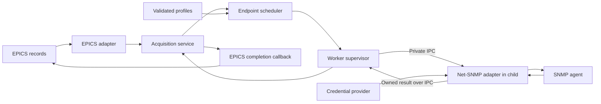

# Extensible SNMP Architecture

## Scope

This proposal separates EPICS record completion from acquisition scheduling
and SNMP security/session management. It targets maintainable SNMPv3 evolution,
including algorithm changes, credential activation at IOC startup and device
recovery. Security profile, credential and engine identity changes require IOC
process restart.
The current implementation is described in [SnmpRequest](snmp-request.md).
The canonical milestone owns implementation ordering, acceptance, test cases
and observed results: [M8](milestone-db9ebf5.md#m8---extensible-snmpv3-architecture)
for this architecture and [M9](milestone-db9ebf5.md#m9---request-driven-writes)
for "Request-Driven Writes".
The components below are proposed contracts, not existing APIs, except where a
section states that the module implements them.

Net-SNMP's documented, version-verified facilities are the implementation
default. The module adds EPICS semantics and application policy; it does not
duplicate a protocol/security facility because an internal abstraction would
be convenient. An exported symbol is evidence of availability, not by itself
a stability, thread-safety, or interoperability guarantee.

**Out of scope:** changes to the legacy output path, an all-record fanout barrier,
automatic security downgrade, proprietary cryptography, firmware updates,
production rollout, live credential/profile replacement and changing PVA schemas.
Additional SNMP security models may fit behind the backend boundary later; this
proposal initially covers USM.

## Required Behavior

For each supported request-driven input, preserve request acceptance,
matching response or terminal error, result/conversion/alarm processing,
FLNK, and then PACT clear. Base explicitly separates the initial asynchronous
return from completion [1]. Fanout visits local passive links in order [2];
the asynchronous return rule in [1] means it does not await a target's
asynchronous completion. A serial dependency
therefore belongs in the source record's FLNK chain.

An idle request-driven input generates no application GET. Discovery and
recovery traffic are separate, bounded control operations. A successful
unchanged value still completes; an error retains the old value and marks it
invalid. No component treats a legacy cache update as a new request's success.

The existing Snmp DTYP, polling behavior, record conversions, INP syntax and
output behavior remain compatibility contracts. SnmpRequest remains opt-in
for ai, longin and stringin. Modernization must not silently migrate a site to
a different protocol, user, algorithm, security level, or SET retry policy.

The [worker watchdog policy](decisions/ADR-20260923-worker-watchdog-policy.md)
preserves effective native timeout/retry settings. An omitted watchdog setting
uses a compatible finite bound derived from those settings and bounded native
control operations; it does not impose a fixed 10-second default.

## Components And Ownership

| Component | Owns | Boundary |
| --- | --- | --- |
| EPICS adapter | Record binding, PACT, Base callback, conversion and alarm mapping | Exchanges typed requests/results; contains no USM keys or Net-SNMP sessions. |
| Acquisition service | Request generation, absolute deadline, terminal-result arbitration, bounded admission and batch membership | Has no dbCommon pointers or Net-SNMP structures; delivers one immutable result to an opaque completion handle. |
| Endpoint scheduler | Endpoint admission, batching, fairness and retry budgets | Uses validated profile identity; schedules application requests separately from discovery/recovery. |
| Configuration and security profiles | Validated immutable endpoint/security descriptions and capability policy | Parser syntax is independent of the backend's C structures. |
| Credential provider | Secret input references, credential revision and input-buffer retirement | Supplies credentials to Net-SNMP; creates no parallel localized-key cache or USM database. |
| Worker supervisor | Child lifecycle, private IPC, worker epoch and transport progress deadline | Never calls Net-SNMP or enters record processing; isolates blocked library calls by configured transport address. |
| Net-SNMP adapter | Library handles, callback context and mapping to owned results | Calls library transport, PDU and USM facilities; never processes an EPICS record or implements cryptography. |
| Diagnostics | Bounded trace, counters and latency/resource observations | Reads snapshots without taking record or transport locks. |


```mermaid
flowchart LR
    DB[EPICS records] --> EA[EPICS adapter]
    EA --> AQ[Acquisition service]
    AQ --> SC[Endpoint scheduler]
    CP[Validated profiles] --> SC
    SC --> WS[Worker supervisor]
    WS -->|Private IPC| BE[Net-SNMP adapter in child]
    CS[Credential provider] --> BE
    BE --> AG[SNMP agent]
    AG --> BE
    BE -->|Owned result over IPC| WS
    WS --> AQ
    AQ --> CQ[EPICS completion callback]
    CQ --> DB
```

Keep this in the existing module initially. Net-SNMP is the selected protocol
library; a thin boundary isolates its version-specific API and ownership from
records. A generic plugin framework or replacement SNMP stack is not required.
The worker-process runtime below is the recommended proposal supported by the
native-library experiment recorded in M8. Its IPC and IOC integration are not
implemented or verified; adoption remains a design-review decision.

## Request And Result Contract

A request contains an immutable binding ID, record generation, profile
revision, operation, OID, result capacity and absolute monotonic deadline.
Record pointers stay inside the EPICS adapter. A result owns its bytes and
typed value; it cannot reference a freed PDU, session buffer or mutable cache.
Preserve INTEGER signedness, unsigned counter types, lengths and octets until
the adapter applies the existing record conversion rules. Reject overflow
instead of narrowing silently. Legacy text masks are a compatibility view,
not the backend's universal value representation.

A transaction carries an opaque identity plus session and profile revisions.
The library request ID alone is insufficient across reopen or ID reuse.
Binding/profile revisions remain immutable within an IOC process. Batch
membership freezes when the scheduler hands the transaction to the backend,
before any asynchronous send can complete. Later
requests wait for a later transaction, even if their OID matches.

One state transition arbitrates success, failure, deadline and cancellation:

```text
Accepted -> Queued -> Dispatched -> Terminal -> CompletionPending -> Retired
                \--------------------^
```

Queued requests may expire without transmission. Each accepted request gets
one terminal result. Callback queue pressure retains CompletionPending and
retries delivery without repeating I/O. Record generations prevent a retired
response from satisfying a later processing pass. IOC shutdown abandons pending
work through an explicit shutdown disposition and does not synthesize FLNK.

One preallocated request/result slot per registered input bounds the normal
path. If admission is full, complete that attempt as an explicit record error;
do not leave PACT set with no completion owner. Bound session, batch, retry and
diagnostic storage separately. A late network response may release transport
resources after record timeout, but cannot change the terminal result.

### Input Record Processing

Request inputs follow Base asynchronous input processing for ai, longin and
stringin. The first pass admits the request, sets PACT and returns; the
completion pass runs in a Base callback at the record's PRIO read when the
request was admitted, under the record lock, and record support converts,
checks alarms, posts monitors and processes FLNK before PACT clears.

A failed completion sets severity INVALID with status TIMEOUT for a library
timeout after its retries, including a reply the library discards as
malformed, or for the request deadline, and READ for every other failure:
admission, session open, send, security, agent error status, varbind and
conversion. These are menuAlarmStat choices.

While PACT is set, Base dbProcess does not call record processing. A periodic
scan that finds the record active is dropped; after ten consecutive drops Base
raises severity INVALID with status SCAN, so RequestTimeoutMSec longer than
ten scan periods can raise that alarm; Base skips it while the record is
already INVALID. A put through dbPutField to PROC sets RPRO on any record, and
so does a database link that writes PROC in a chain that started from
dbPutField. On a Passive record, a put through dbPutField to any other
process-passive field, such as VAL, also sets RPRO, and so does a FLNK or
process-passive database link in a chain that started from dbPutField. The
record then reads again after completion. A CP or CPP link update is processed
through db_process, which sets PUTF, or RPRO on an active record, so a chain
it starts follows the dbPutField rules. A trigger in a chain that started from
a scan, an event or an I/O Intr is not repeated. A CA put without callback,
including one through a CA link, reaches the record through dbPutField and
follows these rules. A CA put with callback, as from caput -c or an Async Soft
Channel output over a CA link, goes through dbProcessNotify instead: Base
holds it while the record is active and never sets RPRO. After the current
completion it stores the value; for a put to PROC, or to a process-passive
field of a Passive record, it then processes the record once more and
completes the callback after that pass, so the client waits for a new SNMP
read. Otherwise the callback completes once the value is stored. An Async Soft
Channel output over a database link uses an ordinary database-link put.

If simulation mode is switched on while a read is active, record support
takes the simulated value and does not call device support. The module
discards the SNMP result as failed after that pass and frees the slot, so the
next pass after simulation ends reads the device again. A change arriving
through SIML is read only at the start of a pass: the active read consumes
its device value normally, and simulation takes effect at the next pass. If
simulation mode is switched off while a delayed simulation pass (SDLY) is
pending, that pass calls device support with no request and completes with
READ/INVALID and VAL unchanged; no request is sent and the next pass reads
the device.

## Request-Driven Writes

This section is the contract the module implements for request outputs
(`DTYP="SnmpRequest"` on ao, longout and stringout). It applies Base
asynchronous output processing, as described for ao, longout and stringout
in their record references, to one SNMP SET per processing pass. The legacy
`Snmp` output path is unchanged.

### Why Writes Are Asynchronous

An SNMP SET is a network round trip, so no device support can finish it inside
one record processing pass. The legacy path queues the value and returns
success at once; every legacy defect follows from that: the record, its FLNK
and a put callback complete before a packet exists, an agent error or a
timeout raises no alarm, a queued value can be replaced unseen, and the device
value is inferred from a poll cache behind a timing window. Base asynchronous
device support is the mechanism made for this case: the first pass admits the
SET for sending and sets PACT, the record stays active, and the agent's answer
or a terminal error completes it, so the alarm reports the real result, a put
callback ends when the agent has answered, and FLNK runs after the result.
This is what the read path gained with SnmpRequest inputs.

The cost is that the record is open between the two passes. Base handles a
value that arrives then through RPRO and the rules under Writes During An
Active Write, but longout OOPT does not fit this shape: Base repeats the
OOPT test in the completion pass and updates PVAL there, so under "On
Change" and the two Transition settings, which compare VAL with PVAL, a
value put during the write is never sent and a retry of a failed value
sends nothing; "When Zero" and "When Non-zero" look at VAL alone and do not
lose values, but they still skip the completion call. The contract therefore
keeps
OOPT at "Every Time" on request outputs and leaves the "send only when the
value changed" decision to a synchronous record in front of the output, as
described under Binding. The same holds for every asynchronous output
support, including StreamDevice and asyn; it is a property of the
combination, not of this module.

### Binding

`DTYP="SnmpRequest"` selects the request-driven write path for ao, longout and
stringout, as it does the read path for ai, longin and stringin. The OUT field
keeps the legacy output syntax: host or `endpoint:NAME`, community or `-`,
OID, mask, buffer length and the set type letter with optional flags. Legacy
hosts and named endpoints both apply. The set type selects the SNMP type:

| Record | Set type | SNMP type | Value sent |
| --- | --- | --- | --- |
| ao | `i` | INTEGER | OVAL, or RVAL with the `R` flag |
| ao | `F` | Opaque float | OVAL |
| longout | `i` | INTEGER | VAL |
| stringout | `s` | OCTET STRING | VAL up to its terminating null |

The `R` flag selects RVAL and is accepted only on ao with set type `i`, where
the record's unit conversion produces it. That conversion runs before the
device write routine and clamps a value beyond the INTEGER32 range to the
range limit, and it turns a NaN into a converted integer with UDF set, so the
encoding checks under Processing see only the converted value and refuse
neither; a site that must refuse such values sends OVAL without `R` or bounds
VAL with DRVH and DRVL. Any other record and set type pair,
`R` on ao `F`, `R` on longout or stringout, or any flag other than `R` fails
the binding with a record error. The mask is not used. The buffer length must
be 2 through 65536 bytes, as for request inputs; for a request output it
bounds only the octets a stringout sends (at most 39, the VAL field's
capacity) and plays no part in the response, which is decoded as a typed
value, never through the legacy text view; the match itself is defined under
Result And Confirmation. SCAN may be any value except I/O Intr, which fails
the binding. A longout must keep OOPT at "Every Time" for the reason given
under Why Writes Are Asynchronous; any other OOPT fails the binding. OOPT is
not a protected field and can be changed while the IOC runs, and device
support has no hook on a field put, so the module watches the field instead.
At binding it subscribes to `<record>.OOPT` through the IOC's own monitor
service: dbChannelCreate and dbChannelOpen on the field, one module event
context from db_init_events and db_start_events with the thread name
`snmpOopt` (unique and within the 15 characters a thread name carries, so
tests can find it), then db_add_event with DBE_VALUE and db_event_enable; this
is the path the CA server and in-IOC CA links use. dbPut posts a DBE_VALUE
event for every put to a field other than VAL, so a change to OOPT reaches the
module's event thread right after the put. The callback takes the record lock
and reads OOPT from the record, never from the value carried in the event,
because the event holds the value at the time of the put and a first pass or a
completion callback may already have restored the field; if the field reads
"Every Time" the callback does nothing (its own restore posts such an event).
Otherwise it sets OOPT back to "Every Time", posts the field, logs the record
name and the value it replaced, and publishes WRITE/INVALID without processing
the record in the way dbProcess publishes its SCAN alarm: recGblSetSevrMsg,
recGblResetAlarms and db_post_events on VAL, so SEVR and STAT change at once
and no pending severity carries into the next pass. No SET is sent. The write
routine on every first pass reads OOPT as well and, if it still finds another
value, restores and posts it, logs it, raises WRITE/INVALID with recGblSetSevr
only and returns a negative status without sending; record processing
publishes that alarm, so the write routine must not publish it itself, or the
monitor() step would overwrite it with NO_ALARM. The completion callback also
restores a changed OOPT before record processing, posts it and logs it, and
then reports the write it holds exactly as the agent answered: a success
completes with NO_ALARM and, for ao, the RBV update; a failure completes with
its own status. The OOPT change is not a result of that SET and does not alter
its report; when the completion callback restores it before the monitor event
runs, the change therefore leaves a log line and no alarm. One window remains:
a put to OOPT followed, before the event thread runs, by a put of a value that
the new setting's own test rejects (under "On Change" the value PVAL holds;
under "When Zero", "When Non-zero" and the Transition settings any value their
test refuses) reaches Base's OOPT test before any of these checks, and that
value is not sent. The monitor then restores OOPT and publishes WRITE/INVALID,
so the loss is reported but the value must be put again. A site that must
close that window, or wants the change refused instead of reverted, makes OOPT
read-only through access security; that is a site setting and not part of this
contract. Where a site must avoid repeated SETs of an unchanged value, compare
the value before the record in a synchronous calcout that drives the longout
through OUT with PP: DOPT "Use OCAL" with OCAL returning the requested value,
and OOPT "When Non-zero" on a CALC condition such as "the request differs from
the value last handed over, or the last write failed", where the value last
handed over is the calcout's own OVAL read through an input link and a failed
write is the longout's STAT being WRITE or TIMEOUT (SEVR alone would also
retry on a SCAN alarm or a limit alarm; the STAT test still retries after the
OOPT monitor's WRITE alarm, which is wanted, since a value lost in the
monitor's window must be put again); the
calcout's comparison runs once per input and never in a completion pass. When
the calcout is processed by a put or a CP link, a value it hands to an active
output sets RPRO and is sent after completion. When it is periodically
scanned, its condition must also require the output's PACT to be clear, so
that nothing is handed to an active output and the next scan repeats the
comparison, and the failure branch then retries at the scan rate while the
device refuses; a scanned calcout with OOPT "On Change" does not work, because
calcout updates PVAL on every pass and a change consumed while the output was
active is never output.

Initialization performs no device read and sends nothing. ao init_record
returns 2 so VAL comes from the database or autosave without RVAL
conversion; PINI follows Base rules.

### Processing

First pass: record support fetches and converts the value as usual (OVAL and
RVAL for ao). The device write routine, under the record lock and before any
network I/O, checks and if needed restores OOPT (longout) and runs the
encoding checks of the table
below on the record's typed value (ao OVAL as double, ao RVAL and longout
VAL as long, stringout VAL as text). If a check fails, it raises
WRITE/INVALID, does not set PACT and returns a negative status, as Base
defines for a failed write; the record completes in that same pass, with
FLNK and any put callback, and nothing is queued. A CA put without callback
then receives ECA_PUTFAIL, because dbPutField returns the process status and
the CA server reports a negative one; a CA put with callback completes
normally, because dbProcessNotify discards the process status, and sees the
result only in the alarm. Otherwise
it copies the checked value into an owned typed request, admits it, sets
PACT and returns 0. The value is captured here; a later change to the record
does not alter a queued request.

Encoding: the native adapter's SET encoder turns the checked typed value
into the SNMP type from the table above with snmp_pdu_add_variable, as
binary, never through printf text and snmp_add_var as the legacy path does
(L7). This is the one place where a record value changes representation; the
encoder receives only values that passed these checks in the write routine:

| Set type | Check before encoding | Encoded as |
| --- | --- | --- |
| `i` from ao OVAL | finite, integral, within INTEGER32 | ASN_INTEGER |
| `i` from ao RVAL or longout VAL | within INTEGER32 | ASN_INTEGER |
| `F` from ao OVAL | finite and within the single-precision float range | ASN_OPAQUE_FLOAT, 4 bytes |
| `s` from stringout VAL | fits the buffer length | ASN_OCTET_STR |

A value that fails its check is never queued or sent; the first pass
raises WRITE/INVALID subject to Base alarm precedence, and the record keeps
the value. NaN with UDFS=INVALID retains UDF/INVALID, as described under
Failures below. The
double-to-float narrowing loses precision by design, since the device holds
a float; a negative zero is encoded as 0.0, as the legacy path does, because
some devices reject it. Record-level limits such as ao DRVH and
DRVL are the user's way to keep values inside the device range and may
make this check unreachable, but the check stays: it is what keeps the
module from ever performing a conversion whose result C++ leaves undefined.
On a platform whose Net-SNMP build lacks opaque special types, binding a
record with set type `F` fails with a record error.

Completion: the terminal result of that one SET schedules the Base callback.
The callback takes the record lock and, for a failed write, raises the alarm
from the Failures table with recGblSetSevr before it calls record processing,
so the alarm appears in that pass whether or not record support calls device
support. Record processing then runs with PACT still set: the device write
routine stores the result and returns 0, and record support checks alarms,
posts monitors, processes FLNK and clears PACT, following the Record
Processing steps of each output record type. A CA put with callback on that
pass completes only after it. No completion occurs before the agent answers
or a terminal error is known.

Record support can finish a completion pass without calling device support:
simulation mode switched on during the write, or IVOA "Don't drive outputs"
after a put moved VAL into an INVALID limit. The alarm raised before
processing still reports the result; the module then frees the record's slot
and records the result as discarded. If simulation mode is switched off while
a delayed simulation pass (SDLY) is pending, that pass calls device support
with no request and completes with WRITE/INVALID; no SET is sent. A SIML
change is read only at the start of a pass, as for inputs.

### Writes During An Active Write

While PACT is set, dbProcess does not call record processing. Every
processing request that reaches dbProcess while the record is active, from a
scan, a FLNK, a process-passive database link or a link that writes PROC, is
dropped and counted in LCNT, including one in a dbPutField chain that also
set RPRO; the eleventh consecutive drop makes Base raise INVALID with status
SCAN unless the record is already INVALID. A direct put through dbPutField,
a CA put with callback held by dbProcessNotify, and a CP or CPP update of
the active record itself, set RPRO or wait without reaching dbProcess, so
they are not counted. A put
through dbPutField, as from a CA put without callback or from dbpf, to a
process-passive field of an active Passive record, or to the PROC field of
any active record, stores its value and sets RPRO; at the end of the
completion pass, recGblFwdLink queues one more processing through scanOnce,
which sends the latest value. A CA put with callback, as from caput -c or an
Async Soft Channel output over a CA link, goes through dbProcessNotify
instead: Base holds it while the record is active, then stores the value; for
a put to PROC, or to a process-passive field of a Passive record, it
processes the record once more and the callback completes after that pass,
otherwise the callback completes without another pass and the value is sent
at the record's next processing.

Database links follow the dbPutField rule: a database link that writes PROC
sets RPRO on any record, and on a Passive record so does a process-passive
database link or a FLNK, when the chain started from dbPutField or from a
CP or CPP link update, which db_process treats as a put. In a chain that
started from a scan, an event or an I/O Intr the value is stored without
reprocessing and is sent at the record's next processing. Values overwritten
while the record was active are not sent. This is Base behavior, not module
coalescing: a reprocessing pass is one more write with its own deadline and
result, and a value stored without reprocessing waits for the record's next
processing. The module keeps no per-OID pending value for request outputs
and never merges two writes.

### Result And Confirmation

A write succeeds when the agent returns a response with error status zero and
exactly one varbind whose OID and SNMP type both equal those sent. A response
that repeats the OID with another type, or with no value, is not a match and
fails as WRITE: the agent did not accept the request as sent. For ao with set
type `i`, the response INTEGER, when within DBF_LONG, is stored in RBV in the
units sent (raw with the `R` flag, engineering otherwise); with set type `F`
the response float is not stored, since RBV is DBF_LONG. Base posts RBV only
when it changes. An SNMP agent answers a SET by returning the values it
accepted, so RBV confirms that the agent accepted the value, not that the
device holds it. Where the device value matters, read the same OID with a
separate SnmpRequest input. longout and stringout have no readback field;
their result is the alarm state. Request outputs never read the legacy poll
cache, need no polling of their OID and use no timing window.

### Failures

Every admitted write completes its record exactly once, except at IOC
teardown as stated below. A failed write leaves
VAL as record processing left it and RBV unchanged, and raises severity
INVALID with status:

| Terminal result | Alarm status |
| --- | --- |
| Agent error status, or a response without exactly one varbind matching the OID and type sent | WRITE |
| Value not encodable, send failure, security error, admission full | WRITE |
| No response: library timeout after its retries, a reply the library discards, retirement of a session that sent the SET, or the request deadline | TIMEOUT |

Alarm selection follows Base priority: an alarm already raised at the same
severity is not replaced. In particular, NaN on an ao with UDFS=INVALID
raises UDF/INVALID before device support. For INTEGER without `R` and Opaque
float, the module rejects the unencodable OVAL without sending a SET; both
the record and its FLNK observe UDF/INVALID. With `R`, Base converts VAL to
RVAL before device support, as described under value encoding. IVOA and a
configured UDFS continue to follow Base rules.

The traditional per-host queue has no transaction-count or byte capacity
bound. The worker FIFO defaults to 1024 pending commands and limits charged
encoded data to 1 MiB; active native work is separate. `devSnmpSetQueueSize`
changes one address worker's count bound before or after `iocInit()`. A decrease
retains queued work and rejects new tickets until count is below the new bound;
existing legacy SET replacements do not add tickets. Each command reserves its
payload plus 40 bytes of single-command framing. Slot, shutdown and payload
rejections do not qualify the queue-capacity boundary.

These are menuAlarmStat choices. TIMEOUT means the outcome is unknown: the
SET may not have been sent, or the agent may have applied it without a reply
arriving. IVOA acts, as in Base, on alarms raised during a processing pass
before the write routine runs. Because the callback raises a failure before
the completion pass, IVOA sees it in that pass: with "Don't drive outputs"
record support skips the write routine, so the alarm stands and an ao does
not receive the RBV update, and with "Set output to IVOV" Base changes VAL
only on a first pass, so VAL is untouched. A failure raised by a completion
pass does not block a later write.

### Delivery, Ordering And Deadline

In the staged traditional transport, request writes use their own queue on
each host. The worker scheduler uses one admission-order FIFO per configured
address for legacy polls, request reads and both kinds of writes. Legacy
per-OID pending settings remain separate from immutable request writes.
Each admitted request write is one SET transaction carrying one OID,
never replaced by or merged with another write, and never resent by the
module after a terminal result. The host sends queued request SETs one
transaction at a time in admission order, and a queued request SET goes before
polls queued after it. A request SET does not change the legacy pending
setting or the SetSkipReadbackMSec window of any legacy record.

Net-SNMP retransmissions within a transaction reuse the request ID; if a reply
is lost after the agent applied the value, the agent may apply it again. For a
non-idempotent OID, bind the record to a named endpoint with retries 0; a
legacy host shares the global SessionRetries with all its reads. SNMP
provides no exactly-once guarantee.

The request deadline, RequestTimeoutMSec, applies as it does to reads. A write
still queued at its deadline completes with TIMEOUT and is not sent. A write
whose SET is on the wire at its deadline completes with TIMEOUT while the
transaction runs to its own end, and a late response cannot change the
result. The record may then admit its next write; that write waits in the
queue behind the earlier transaction, so one record never has two SETs on
the wire. With inherited transport settings a lost SET holds the host for
about 60 s until session retirement, and writes queued behind it expire.

Request outputs share the shutdown disposition of request inputs: pending
writes are abandoned without synthetic completion during IOC teardown.

### Out Of Scope

bo, mbbo and waveform outputs; other set types; write batching; module-level
retries; and exactly-once device application.

## Security Configuration

Separate named endpoint definitions from reusable security profiles. Endpoint
definitions contain address/transport, timeout/retry policy, batch limits,
optional securityEngineID/contextEngineID settings and profile binding. A reusable
USM profile contains securityName, securityLevel, exact authentication/privacy
protocol identifiers, contextName and credential reference. Engine identity
settings belong to the endpoint so a security profile can serve multiple agents.
The immutable binding identifies the endpoint and complete profile revision.

Existing iocsh setters and config-file tokens map through one compatibility
parser. Keep existing record links valid. The additive syntax below selects
named endpoints explicitly; the existing community field is not reinterpreted
as a profile name.

Configure endpoints and profiles before loading their records. Parse a complete
startup candidate, validate it, then publish atomically. Reject
unknown algorithms, unsupported combinations, missing keys, truncation and
derivation errors before application requests. Invalid startup configuration
fails the affected binding explicitly. Security profile, credential and engine
settings freeze when the endpoint's records are initialized; reject subsequent
changes to that binding and reject all such configuration calls after iocInit.
Recovery never rereads configuration or secret files. Diagnostics identify the
field and profile without echoing secrets or raw credential-bearing lines.

Resolve algorithm names, types and OIDs with Net-SNMP's own lookup helpers.
The module retains only validated profile selection and site-policy filtering,
not a second table of protocol OIDs, key lengths or crypto implementations. Include
HMAC-SHA-2 protocols from RFC 7860 [3]; propose authPriv with SHA-256
authentication and AES-128 privacy from RFC 3826 [4] as the new-profile baseline,
conditional on site policy and measured device support. Retain explicitly selected legacy
combinations where policy permits. No automatic fallback occurs. AES-192/256
vendor variants are separate capabilities requiring exact protocol and key
extension identification; an AES label alone is insufficient.

Capability reporting distinguishes implemented, linked-library available,
policy allowed and device verified. Header symbols do not establish that the
linked crypto provider accepts an algorithm. A profile never silently negotiates
down to a weaker protocol or security level. Operator-selected noAuthNoPriv and
authNoPriv remain distinct explicit configurations, not recovery modes.

### Named Profile And Endpoint Syntax

The public commands are additive. devSnmpLoadV3Profile, devSnmpDefineEndpoint
and devSnmpSetEndpointParam, the named link grammar and the profile and
credential file grammar are implemented as specified here; the worker
commands remain proposed. They return zero on success and a
nonzero configuration status on failure; the iocsh wrapper must propagate the
error. A failed definition is never published and never falls back to a legacy
host binding.

| Command | Contract |
| --- | --- |
| devSnmpLoadV3Profile(name, filename) | Validate syntax and credential-file input for one immutable USM profile. Native capability/key validation follows in the endpoint worker before binding succeeds. Duplicate names are errors, including before record loading. |
| devSnmpDefineEndpoint(name, address, profile) | Define one v3 endpoint using an existing named profile and a Net-SNMP transport address. Duplicate names and unknown profiles are errors. |
| devSnmpSetEndpointParam(name, parameter, value) | Set timeoutMSec, retries, maxOidsPerReq, securityEngineID or contextEngineID before the endpoint is bound by any record. Unknown fields and invalid values are errors. |
| devSnmpConfigureWorkers(executable, maxWorkers) | Select an absolute helper path and a positive worker limit before any profile or record initialization. The candidate default worker limit is 32; exceeding it fails admission explicitly. |
| devSnmpSetParam("WorkerProgressLimitMSec", value) | Set a startup-only explicit worker watchdog override in milliseconds before any profile or record initialization. Accept only positive values representable by the public API and the checked deadline calculation. Reject an override below the required native budget before application traffic. If omitted, derive a compatible finite bound from the effective native settings; see Worker Watchdog Policy. |

Names are case-sensitive ASCII identifiers of 1 through 63 characters matching
`[A-Za-z][A-Za-z0-9_.-]*`. Endpoint and profile names have separate namespaces.
The new link grammar reserves the explicit `endpoint:` prefix in the host
position and requires a literal `-` in the community position. An unknown name
or a different placeholder fails record initialization; it never becomes a
network hostname. OID, mask, length and optional output/special flags keep their
existing meanings. Existing links without the prefix use the legacy parser.
Both Snmp and the supported SnmpRequest records can select a named endpoint.

```text
devSnmpConfigureWorkers("/opt/snmp/bin/linux-x86_64/snmpWorker", 32)
devSnmpLoadV3Profile("pduRead", "/etc/ioc/snmp/pdu-read.conf")
devSnmpLoadV3Profile("pduWrite", "/etc/ioc/snmp/pdu-write.conf")
devSnmpDefineEndpoint("pduARead", "udp:192.0.2.10:161", "pduRead")
devSnmpDefineEndpoint("pduAWrite", "udp:192.0.2.10:161", "pduWrite")
devSnmpSetEndpointParam("pduARead", "timeoutMSec", "4000")
devSnmpSetEndpointParam("pduARead", "retries", "0")
```

The string input link is `@endpoint:pduARead - sysName.0 STRING: 32`. An output
uses `endpoint:pduAWrite` with that output's existing OID, mask and flags.
The profile is selected by the endpoint, even when the transport address and
OID are identical. No watchdog override is required: the automatic policy must
cover both the read endpoint's explicit settings and the write endpoint's
inherited settings in their shared worker. The example uses documentation
addresses and proposed APIs; it is not an executable configuration for the
current module.

The profile file uses one `parameter value` per line. Required fields are
securityName and securityLevel. authType is required for authNoPriv/authPriv;
privType is required for authPriv. contextName is optional and defaults to an
empty string. credentialFile is required for authenticated profiles and forbidden
for noAuthNoPriv. Algorithms irrelevant to the selected level are rejected,
not silently ignored. No implicit algorithm default is applied by the parser.

```text
securityName iocReader
securityLevel authPriv
authType SHA-256
privType AES128
credentialFile /etc/ioc/secrets/pdu-read.keys
```

The credential file uses the same line syntax and contains authPassPhrase and,
for authPriv, privPassPhrase. No inline secret is allowed in a named profile
or its iocsh commands. Values extend from the first non-whitespace byte after
the key to the last non-whitespace byte; internal spaces are preserved. Blank
lines and full-line `#` comments are allowed; quoting, escape expansion,
environment substitution, includes and inline comments are not part of this
grammar. Duplicate/unknown fields, NUL bytes and truncated lines are errors.
Keys are case-sensitive in the new files; the existing parser retains its
documented case-insensitive and optional `def` prefix compatibility.

Profile and credential files are limited to 16 KiB, individual lines to 4096
bytes, and passphrases to 8 through 1024 bytes. securityName is 1 through 32
bytes; contextName is at most 32 bytes. Paths are absolute. Open a credential
file without following its final symlink, then validate the opened descriptor:
regular file, owner root or the effective IOC user, no group/other permissions.
Read and validate the complete startup snapshot before publication. Errors
identify the file role and field without printing its value or source line.

The endpoint inherits existing transport timeout/retry/batch defaults unless
explicitly set. New numeric setters accept complete decimal values: timeoutMSec
1 through 60000, retries 0 through 5 and maxOidsPerReq 1 through 1024. These are
proposed admission bounds, not measured device limits; encoded-size limits still
apply. Legacy setters keep their valid existing inputs through the compatibility
adapter. Endpoint security and native transport configuration freeze and restart
requirements apply to every corresponding entry point, including legacy setters.
The parent-side devSnmpSetQueueSize admission setting is independently adjustable
at runtime. There is no endpoint delete/redefine/reload operation.

### Engine Identity Settings

The following additive settings use the existing
devSnmpSetSnmpV3Param(hostname, parameter, value) command and the same parameter
tokens in devSnmpSetSnmpV3ConfigFile(hostname, filename). They apply to that
host's endpoint configuration, require SNMPv3 and must precede record loading.
Named endpoint configuration uses the same field meanings. Both settings are
implemented for the host setter, the configuration file and named endpoints.

| Parameter | Omitted | Explicit value and native mapping |
| --- | --- | --- |
| securityEngineID | Leave the native security engine ID unset; Net-SNMP discovers the target's authoritative engine. | Expected authoritative engine ID, mapped to securityEngineID/securityEngineIDLen. A different observed identity is an error, never an automatic replacement of the configured value. |
| contextEngineID | Use the authoritative engine ID resolved for this endpoint as the context default. | Context engine ID, mapped independently to contextEngineID/contextEngineIDLen. It does not replace securityEngineID or select a different authentication identity. |

Both settings accept contiguous hexadecimal byte pairs, with an optional 0x or
0X prefix and case-insensitive hex digits. Reject empty values, odd digit counts,
non-hex characters, separators, lengths outside 5 through 32 bytes, all-zero
values and all-FF values before opening a session. The byte-length and excluded
values follow the SnmpEngineID textual convention [5]; spelling normalization
does not alter the identity bytes. Omission selects the default, while an empty
explicit value is a configuration error. A configured ID is the actual agent or
context identity, not an IOC port name or an arbitrary alias.

Store the configured security identity separately from the identity learned by
the native session. Validate identity before accepting a successful result; a
native REPORT/recovery path must not silently change an explicitly configured
expectation. A silent drop still becomes a timeout unless a mismatch is actually
observed. In automatic mode, a changed engine identity may recover only through
the library's normal security setup, without reusing the old localized key.

Providing securityEngineID does not remove authentication timeliness handling:
engineBoots/engineTime synchronization is still required for authenticated
communication [6]. Net-SNMP performs that work and REPORT handling in both modes;
the module adds no probe, time estimator or second USM cache. Discovery-isolation
tests cover both automatic and explicit modes, including reboot and recovery.
Diagnostics distinguish configured and observed IDs, automatic versus explicit
selection, and the context ID, without exposing credential material.

## Credential And Engine Lifecycle

USM localized keys depend on the authoritative engine identity [6]. The
credential provider owns the configured input; Net-SNMP owns key localization,
USM users, engine-time state and cryptographic operations. When supplying a
session from a passphrase, use generate_Ku once per startup session template
and let the normal library session/USM path localize it.
Do not add a module-side localized-key cache, engine-time estimator or USM user
database. Session/profile revisions still belong to the module because they
identify EPICS request ownership, not cryptographic state.

The credential provider reads protected local files at startup.
Provider extension does not change the request contract. New v3 profiles put
no secrets in DB links, PVs, status dumps, trace entries or normal test evidence;
existing v1/v2c INP community syntax remains a compatibility exception. Minimize
copies, clear owned buffers on retirement using an available non-elidable
facility, and document any copies retained by the linked library. Do not claim
that clearing one buffer erases library internals or process dumps.

The running IOC uses a validated startup snapshot. Editing a credential file
does not change queued, in-flight or completion-pending requests and does not
trigger reload. Apply new credentials or profile/engine settings by stopping the
IOC process and starting it with the new configuration. The old process follows
the normal shutdown contract; the new process validates its inputs before
application traffic. Invalid startup inputs fail the affected binding and never
fall back to credentials from a previous run.

There is no live replacement API, file watcher, admission pause for credential
cutover or in-process USM user replacement. Closing/reopening a transport session
is recovery with the same startup snapshot, not credential activation. This
changes IOC configuration only; device-side USM provisioning is separately
coordinated.

USM cache identity and lifetime must be verified against the actual library.
Two profiles with conflicting keys for the same engine/user cannot be assumed
isolated merely because session pointers differ. Within one worker, all profiles
using the same securityName must have compatible authentication/privacy protocols
and credential bytes, regardless of context. Reject conflicting definitions
during startup, before discovery or application traffic. Compare credential
content, not filenames; do not publish a secret digest in diagnostics.

This conservative rule deliberately does not wait for automatic engine discovery
inside a send call. Different configured addresses have separate processes and
USM state, allowing the same username with different keys on different devices.
Address aliases are not proof of device identity; configuring one device through
different address strings does not promise shared serialization or shared cache
validation. This proposal replaces the draft's unverified requirement to intercept
discovery before native send proceeds. T9 must verify actual worker isolation and
startup conflict rejection. No module USM cache or user-list replacement is added.

## Sessions, Discovery And Recovery

Separate request lifetime from transport session lifetime. Retain a healthy
session across transactions while its endpoint, security profile and engine
identity remain compatible. Per-endpoint application serialization remains the
initial behavior; batching may combine compatible pending OIDs. Reuse does not
authorize concurrent writes or additional SET retries.

The proposed adapter lifecycle states are Unresolved, Opening, Ready,
Recovering, Draining and Closed. They describe the library handle, not a second
USM/discovery state machine. Discovery and recovery consume a bounded endpoint budget,
while every queued request retains its own original deadline. Engine reboot
and changed engine identity invalidate different state; both require actual
USM recovery verification. A changed engine must not reuse old localized keys.
An explicit pinned engine identity mismatch is an error, not an automatic
rebind. Authentication failure is not a reason to lower security.

Use one explicit library ownership domain per worker for initialization, MIB parsing,
session operations and USM state. Network callbacks only deliver owned results.
No network/discovery wait holds a record lock. Completion/deadline handling
remains able to run when a transport operation stalls. Across healthy endpoints,
one endpoint's retries must not monopolize dispatch or response service.

Use normal Net-SNMP session opening, discovery and USM report handling. The
upstream v5.9.4 usm_discover_engineid uses snmp_sess_synch_response [7]; the
plan therefore does not require a new asynchronous discovery implementation,
a copied internal probe routine, or SNMP_FLAGS_DONT_PROBE followed by custom
report handling. All library calls run outside record and completion threads;
the isolation boundary covers opening, sending and response/recovery handling.
Reuse healthy sessions to avoid unnecessary opens, but measure actual discovery
traffic rather than inferring it from the number of handles.

The serialized-owner experiment in M8 observed blocking discovery in the first
snmp_sess_async_send, while snmp_sess_open returned promptly. A single owner
therefore cannot guarantee progress for unrelated healthy endpoints merely by
using the asynchronous send API. Name lookup and recovery may also block. The
library's thread guidance does not establish SNMPv3 thread safety [8]. A
single-session handle is also not proof of isolated process-wide USM state.

The proposed runtime uses isolated backend worker processes retaining the same
native calls. The preliminary process experiment establishes overlap during a
real discovery wait, but does not establish IOC deadline, IPC, reboot or resource
acceptance. M8 / T8 retains its full cold/recovery and healthy-progress criteria;
T18 covers the new process boundary. Initial prewarming alone cannot satisfy
recovery tests, and the module must not implement a parallel discovery protocol.

During migration, no two independent executors may enter the same process-wide
Net-SNMP state concurrently. Legacy GET/SET calls must move through the same
worker path before mixed operation is enabled. The final IOC-side adapter makes
no Net-SNMP calls, including initialization, algorithm lookup or MIB parsing.
Other IOC modules' library state is then outside these workers. Intermediate
in-process stages still require a process-wide ownership audit.

### Worker Runtime And Deployment

One persistent snmpWorker process serves one configured transport address;
profiles at the same address share the worker, its serialized library owner and
its fair application queue. Different address strings are separate ownership
domains; the module does not infer that DNS aliases identify one device. Use one
address spelling for a device when cross-profile ordering is required. The
initial scheduler permits one application transaction per worker, with separate
reusable sessions for compatible endpoint/profile/context bindings. Independent
workers provide concurrency across devices without assuming v3 thread safety.
Profiles at the same address deliberately share the device's serialization;
the healthy-device isolation criterion applies across different addresses.

The helper is an EPICS host product built and shipped with the matching module.
Select its absolute executable path before startup, never by a PATH search or
an external daemon. The build installs a host product in the module's
bin/<arch> directory; dependency paths and the independent module/consumer
build procedure remain governed by the existing EPICS-env runbook. A missing
helper, incompatible protocol/build identity or unsupported platform fails the
affected binding. There is no fallback to the known blocking shared runtime.

Use posix_spawn with an inherited private socketpair; do not run a shell or
execute library code between fork and exec in the threaded IOC. Pass only the
IPC descriptor and non-secret bootstrap options as arguments. Close unrelated
descriptors in the child and mark other endpoints close-on-exec. The helper is
owned by the IOC supervisor, has no listening socket and requires no separate
systemd/procServ service. EOF is parent loss; the child must exit without
starting another request. A Linux parent-death mechanism must also terminate a
child blocked inside a library call when its IOC dies, with a parent-identity
check covering startup races. This is initially a Linux runtime proposal.

The parent keeps the validated startup credential snapshot so a crashed child
can recover without rereading files. Bootstrap passes only the profiles needed
by that child through private IPC. The worker disables ambient credential
configuration and persistent secret output, receives explicit startup settings,
and performs native algorithm resolution, key derivation and MIB/OID resolution.
Local configuration/binding replies have a bounded startup wait; no discovery
or application traffic is required to validate syntax or resolve a local MIB.
READY means local bootstrap succeeded, not that the device responded. Session
opening and any transport name lookup begin outside record initialization.
Record processing never waits for this bootstrap. After configuration freeze,
worker restart reuses the same snapshot, profile revisions and bindings.

The private stream protocol uses explicit byte encoding, not copied C structs.
The initial header is 32 bytes: uint32 magic 0x534e4d50, uint16 version 1,
uint16 message kind, uint32 payload length, uint32 reserved zero, uint64 worker
epoch and uint64 transaction ID, all in big-endian byte order. Payload lengths
exclude the header; the frame limit includes it. Strings and arrays have uint32
lengths, checked before allocation; native structure layout is never serialized.
BOOTSTRAP/READY and
BIND/BOUND perform local setup; TRANSACTION/RESULT carry numeric OIDs, operation,
typed values, original monotonic deadline and immutable binding/profile IDs;
STOP initiates shutdown. No record pointers, native session handles or PDU
addresses cross this boundary. Reused request IDs are disambiguated by worker
epoch, transaction identity and record generation in the parent. Deadlines use
uint64 CLOCK_MONOTONIC nanoseconds shared by processes on the same host. Typed
results retain the ASN type, signed/unsigned integer distinction and octet
length; a separate bounded native-formatted text field supports legacy masks.
The decoder rejects an unknown type or an unrepresentable value rather than
coercing it. BOOTSTRAP/READY also exchange the protocol and build identities.

TRANSACTION starts with a uint32 member count followed by length-prefixed
encoded commands. A GET batch contains contiguous compatible members; a SET
contains exactly one. RESULT carries a count followed by binding-identified
outcomes and values. The parent validates the entire result before delivering
any member. Legacy values additionally permit native exception text; request
records retain strict typed-result validation.

IOC IPC is nonblocking and serviced by the supervisor, independently of the
record completion/deadline worker. Handle partial frames and writes explicitly;
reject bad magic/version/kind, oversized lengths and unknown identities before
allocation or result delivery. A malformed frame or truncated EOF retires that
worker and produces one terminal failure for affected accepted requests. An old
epoch or duplicate terminal result cannot complete a request twice. Credit is
returned only when bounded result/context ownership has been released, not when
the record deadline alone expires.

| Resource | Proposed initial bound | Exhaustion behavior |
| --- | --- | --- |
| Worker processes | 32 per IOC, configurable before initialization | Fail excess bindings; never put unrelated addresses into a shared fallback worker. |
| Pending transactions | 1024 by default, configurable per address at startup and runtime through devSnmpSetQueueSize; fixed 1 MiB of encoded queued data per worker | Reject new tickets at or above the count bound or over the byte bound; decreasing the count bound retains existing tickets and deadlines. Record slot ownership remains bounded separately. |
| IPC frame including header | 256 KiB, checked in both directions | Reject oversized bootstrap, request or result explicitly; never truncate a value. |
| Local bootstrap/binding wait | 5 s | Fail initialization of that binding and retire an unresponsive worker. |
| Worker transport progress limit | 150000 ms with inherited timeout/retries; otherwise calculate as below, with an optional explicit startup override | Retire a stalled child; reject an explicitly undersized override before application traffic. Never shorten native timeout/retries to fit. |
| Child restart backoff | 1 s, doubling to 30 s | Resume future work with the frozen snapshot; pending requests retain their original deadline. |
| Shutdown child grace | 2 s, then SIGTERM for 500 ms, then SIGKILL with a 500 ms reap limit | Report incomplete shutdown if the child cannot be reaped; do not free reachable parent callback storage. |

These are proposed limits to test, not proven operating capacities.

#### Worker Watchdog Policy

Preserve the effective native timeout/retry configuration, including inherited
defaults and valid legacy overrides. With no WorkerProgressLimitMSec setting,
derive a finite worker bound that covers every admitted endpoint's native
transport budget plus separately bounded discovery/recovery and local handling
allowances. Profiles sharing one worker must all fit its effective bound.
The default read/write example must bind without a watchdog override.

An explicit watchdog override must cover the same required budget. Reject a
nonpositive, unrepresentable or undersized value before application traffic;
never silently clamp the bound, shorten a timeout or reduce native retries.
Removing the old proposed 600000 ms ceiling does not permit an infinite wait:
all computed bounds and deadline arithmetic must remain finite and checked.

Decision Date: 2026-09-23. The finalized numeric contract is **150000 ms
(150 s)** for the inherited timeout of 10000000 us and retries of 5.
It is an automatically calculated result, not a fixed limit for all settings.
For each endpoint, resolve accepted native default sentinels first, then use
its finite effective per-attempt timeout T_us and retry count R:

```text
B_us = (2 * R + 3) * T_us
A_us = max(5000000, 2 * T_us, ceil(B_us / 10))
RequiredMSec = ceil((B_us + A_us) / 1000)
WorkerMSec = max(RequiredMSec for every endpoint assigned to the worker)
```

B_us accounts for one normal engine discovery with R+1 timer intervals and
one application exchange with up to R+2 intervals, including native timeliness
REPORT recovery. A_us is a selected operating allowance: at least 5 s for local
handling, at least two timeout intervals, and at least 10 percent of B_us so
larger legacy retry budgets also receive proportional allowance. The default
calculation is 130 s plus 20 s. The allowance covers session opening/name
resolution, library/callback work, scheduling and IPC result delivery within
the transaction; it is not another SNMP attempt or a measured worst-case delay.
Use the same conservative rule for cold/warm sessions, automatic/explicit
engine IDs and v1/v2c/v3 bindings; none receives a shorter worker bound.

| Effective timeout | Retries | Native interval budget | Allowance | Required watchdog |
| --- | --- | --- | --- | --- |
| 10000 ms | 5 | 130000 ms | 20000 ms | 150000 ms |
| 4000 ms | 0 | 12000 ms | 8000 ms | 20000 ms |
| 200 ms | 5 | 2600 ms | 5000 ms | 7600 ms |
| 60000 ms | 5 | 780000 ms | 120000 ms | 900000 ms |

Thus the published read/write example uses 150000 ms for its shared worker,
covering the read endpoint's 20000 ms requirement and the inherited write
endpoint's 150000 ms requirement. An explicit 149999 ms override fails for
that worker; 150000 ms is the minimum accepted value. The public
devSnmpSetParam interface accepts an int, so explicit overrides are positive
values through INT_MAX milliseconds. Automatic calculation has no artificial
INT_MAX-millisecond ceiling; it is limited by checked deadline representation.
When an explicit override is present and passes validation against WorkerMSec,
use that override as the effective watchdog interval; otherwise use WorkerMSec.

Calculate in checked uint64 arithmetic. T_us must be positive and representable
by the native timeout field; effective R must be in 0 through INT_MAX-1,
leaving room for the native REPORT path's extra retry increment. Reject a
negative non-default value, overflow in any intermediate, or a result that
cannot become a uint64 nanosecond interval. Implement ceiling division as a
quotient plus a nonzero-remainder test, without an overflowing addition.
Before arming, also check addition to the current CLOCK_MONOTONIC value.
Reject invalid startup budgets before application traffic; if a deadline can
no longer be represented at dispatch, fail locally before writing the frame.
Never clamp or reduce the effective native settings.

Arm one absolute parent-side deadline before attempting the first TRANSACTION
frame byte, using the effective watchdog interval. It includes partial IPC delivery, session opening,
discovery, native retries/recovery and receipt of the complete validated RESULT.
Do not reset it on a packet, RESEND callback, REPORT, heartbeat, partial frame,
read split or waiter expiration. Any permitted sub-operation consumes the
original aggregate budget; it does not acquire a new watchdog interval.
Disarm only after terminal ownership is released or the worker is retired.
An idle worker has no transaction watchdog; local bootstrap/BIND and shutdown
retain their separate bounds in the resource table. A later transaction arms
a new deadline only after the previous transaction is resolved.

The inspected Debian 13 Net-SNMP 5.9.4+dfsg-2+deb13u1 source and 32 real native
cases support the timer accounting; the exact evidence is in M8's Native
Timeout And Retry Evidence. The selected allowance and complete worker path
still require T5/T17/T18 acceptance. This finite fault policy is not a hard
wall-clock guarantee that every native call, DNS lookup or OS scheduling delay
will finish. A child exceeding the deadline is a transport failure; retire it
without replay. Other supported packages must pass the same accounting and
runtime checks before being declared qualified. Numeric policy is finalized;
worker implementation and platform qualification are not yet verified.

The worker watchdog remains independent of each record's acquisition deadline.
A longer native transport budget must not extend the original record deadline
or relax healthy-device isolation. Deadline expiration in the parent is logical
completion, not proof that an already entered native call stopped transmitting.
Preserve the worker's transport context until terminal native completion or
process retirement; never dispatch another transaction to that worker while
its previous one is unresolved.

On IPC handoff, mark a SET as potentially transmitted before the first frame
byte is written. If the child or channel fails before a valid result arrives,
its device outcome is unknown; do not replay that SET automatically after
restart. Commands still wholly queued in the parent remain subject to the
existing output coalescing/order policy. Native retransmissions within a live
transaction retain the configured baseline semantics. Worker replacement never
adds another retry. Reads already handed off also complete as errors on worker
loss; later record processing or the next legacy poll can issue fresh work.

Shutdown stops admission and restart first, sends STOP, drains or abandons
accepted work under the existing shutdown disposition, and retires children
within the bounds above. Base callback draining and PACT/FLNK ownership remain
in the EPICS adapter. The process boundary does not grant a worker permission
to process records or synthesize completion during IOC teardown.

## Net-SNMP Reuse Contract

The proposed session interface is the documented Single Session API [9]:
snmp_sess_init/open/async_send/select_info/read/timeout/close/error. Use the
select_info2/read2 large-FD variants where the target headers and library
support them. Handles from snmp_sess_open must not be serviced by the
traditional global snmp_read, snmp_timeout or snmp_close functions. The existing
traditional API may remain during boundary extraction; switching families is
one explicit adapter migration, not a partial rename.

| Functionality | Reuse | Module responsibility |
| --- | --- | --- |
| Protocol and transport | Native session API, PDU creation/varbind APIs and library encoders/decoders | Session ownership, endpoint policy, PDU ownership and typed-result copying. |
| Asynchronous exchange | snmp_sess_async_send, select_info2/read2 and timeout | Wake the owner for queued work; integrate library wait times with application deadlines. |
| Discovery and timeliness | Normal session/send and USM report processing | Bound library progress and measure isolation; no engineBoots/time cache. |
| Wire retransmission | Session timeout/retries and snmp_sess_timeout | One acquisition deadline and bounded admission; no second packet retransmission loop. |
| Algorithms | usm_lookup_auth_type/priv_type and sc_get_auth_oid/priv_oid | Reject empty/invalid input, constrain accepted aliases, apply policy, and report resolved identity. |
| Credential conversion | generate_Ku and the native USM localization path | Own secret inputs/revisions and reject derivation failure; no custom hash/localized-key implementation. |
| MIB and OIDs | Library MIB loading, read_objid and snmp_oid_compare | Controlled startup loading and identity-based response validation. |
| Session errors | snmp_error on failed open, snmp_sess_error for a live handle, callback operation and PDU status | Copy/sanitize diagnostics, distinguish timeout from proven security error, map terminal results to EPICS. |
| EPICS processing | Existing Base record support and callbacks | PACT, conversion/alarm semantics, exactly-once result consumption and FLNK. |

Net-SNMP's own v5.9.4 argument parser uses the algorithm lookup/type-to-OID
helpers [10]. Follow that path through a small version adapter instead of
maintaining another algorithm registry. The official client example supplies
session key material using generate_Ku [11]. For normal sessions, localization
and USM user setup remain library responsibilities. Neither an example nor an
exported helper establishes support for every installed crypto provider.

Prefer documented public entry points. Exported, header-declared helper APIs
used by upstream tools are permitted behind the version adapter after build
checks; static routines, underscore-prefixed internals and copied USM code are
not integration interfaces. Every added direct library call needs an ownership,
error and version-availability test. The module does not patch Net-SNMP as part
of this plan.

Native configuration tokens/defaults are process-wide state, not automatically
independent per-endpoint profiles. Reuse the library configuration machinery
for its normal initialization and MIB settings; translate IOC endpoint-specific
settings into explicit session fields without repeatedly changing global
defaults. Maintain the existing IOC configuration entry points and a small
validation layer. A generic credential service/plugin system is not required.

The caller owns a newly allocated PDU until send succeeds; the library owns it
after a successful send. Copy response values before returning from callbacks;
do not free a borrowed response or retain pointers into it. Treat CONNECT,
RESEND and intermediate report handling separately from a terminal response,
timeout or send/security failure; verify callback behavior on the linked version.

If one waiter expires, other live waiters on that transaction retain their
response opportunity. Never send an extra GET merely because a library retry
is pending. When all waiters expire, retain the bounded transaction context
until library completion or close the exclusively owned session through its
normal API. The initial one-transaction-per-endpoint policy makes close-based
cancellation possible without silently aborting unrelated transactions; verify
late-callback and close ownership before relying on it. Do not assume a
per-request cancellation API that has not been found and verified.

## Scheduling, Errors And Observability

Batch compatibility includes transport endpoint, SNMP version/security model,
user, security level, exact algorithms, profile/credential revision, configured
and resolved engine identity, and context.
Keep contextEngineID distinct from the authoritative security engineID. Bound
OID count and encoded message size; auth/privacy overhead affects the latter.
A tooBig read response may split a batch within the original deadline and
retry budget. Do not apply this policy to SETs.

Use one bounded admission-order FIFO per worker/address across legacy polls,
explicit reads and writes. A later SET cannot overtake an earlier GET.
Different addresses retain independent worker progress. Batch only contiguous
compatible GETs at the queue head; never skip a SET or an incompatible GET to
fill a batch. Legacy queued SET coalescing retains its original queue position
and replaces only the unsent value; request SETs never coalesce. Once handed
off, batch membership and SET payloads are immutable. Expired requests leave
the queue without transmission; a live native transaction still owns the
worker until completion or retirement. This policy supersedes traffic-class
priority and read-starvation aging in the worker path; see
[FIFO decision](decisions/ADR-20260929-worker-fifo.md).

Net-SNMP alone owns wire retransmission; module
reopen/backoff must not multiply its retry budget or replay a SET. Batching is
an optimization, never a condition that an underfilled request must wait
indefinitely to satisfy. Retain one deadline
across queueing, discovery, retries and recovery. The EPICS callback interval
is measured separately; this is not a hard real-time guarantee.

Terminal results distinguish configuration, admission, transport, deadline,
protocol/security report, access, varbind and conversion errors. A silent drop
is a timeout unless there is evidence of a more specific cause. Alarm mapping
remains in the EPICS adapter. An invalid result never advances last-valid time.

Diagnostics expose profile revision and non-secret algorithm identity,
discovery/recovery counts, session reuse, queued/in-flight/completion counts,
valid-sample age, terminal error classes, and queue/wire/callback latency.
Bound traces and report overflow. Session creation count alone is not proof of
wire discovery; correlate actual packets during controlled tests.

## Shutdown And Compatibility

Before Base stops callbacks: stop admission, cancel or drain backend work,
stop new completion delivery, drain accepted callbacks, retire requests, then
destroy sessions/profiles and records' private storage in the verified order.
No backend owns a record pointer; no callback references freed result storage.
Failed drain is an explicit failure with retained storage, not successful
shutdown. EOF and explicit exit must exercise the same contract.

Migrate behind existing DTYPs in independently verifiable steps. First extract
the adapter and typed boundary while retaining the existing backend. Then
introduce profiles/capability validation and the proven session runtime. Preserve
the legacy polling and SET policy adapter until its own real-path regressions
pass. Rollback restores the matching module, helper, IOC, DB/DBD and configuration pair;
it does not reuse new profile syntax with an older binary.

Legacy SET compatibility requires an executed output baseline, not only the
existing read-only/no-unintended-SET suites. M8 / T17 compares ao, longout and
stringout through actual IOC device support and writable laboratory OIDs before
and after transport migration. Compare values/types, queued-write coalescing and
order, configured wire retries, failure/recovery, output processing/alarms and
shared-OID readback around SetSkipReadbackMSec. A lost response after the agent
applied a SET must not introduce extra module replay beyond the existing library
retry policy. Packet counts do not establish exactly-once device execution.

Enabling a library-supported authentication algorithm should change profile
policy and interoperability fixtures, not ai/longin/stringin processing or a
duplicated protocol-OID table. Replacing
session recovery should change backend code and lifecycle tests, not FLNK
semantics. These dependency checks, together with the M8 runtime matrix, define
whether the architecture has achieved separation.

## References

Sources were retrieved on September 23, 2026. EPICS behavior was also checked
against the local Base 7.0.10 record sources. Reference [7] is the upstream
v5.9.4 source, not proof that the installed 5.9.4.pre2 package is identical;
the linked package remains the required runtime test target. The older thread
guidance in [8] supplies a reason to verify ownership, not a current-version
concurrency test result.

[1] EPICS Collaboration. "Database Locking, Scanning, And Processing." EPICS Documentation. Accessed: Sep. 23, 2026. [Online]. Available: https://docs.epics-controls.org/en/latest/appdevguide/lockScanProcess.html

[2] EPICS Collaboration. "Fanout Record (fanout)." EPICS Base Documentation. Accessed: Sep. 23, 2026. [Online]. Available: https://docs.epics-controls.org/projects/base/en/latest/fanoutRecord.html

[3] HMAC-SHA-2 Authentication Protocols in User-Based Security Model (USM) for SNMPv3, RFC 7860, Apr. 2016. [Online]. Available: https://www.rfc-editor.org/rfc/rfc7860.html

[4] The Advanced Encryption Standard (AES) Cipher Algorithm in the SNMP User-based Security Model, RFC 3826, Jun. 2004. [Online]. Available: https://www.rfc-editor.org/rfc/rfc3826.html

[5] An Architecture for Describing Simple Network Management Protocol (SNMP) Management Frameworks, RFC 3411, Dec. 2002. [Online]. Available: https://www.rfc-editor.org/rfc/rfc3411.html

[6] User-based Security Model (USM) for version 3 of the Simple Network Management Protocol (SNMPv3), RFC 3414, Dec. 2002. [Online]. Available: https://www.rfc-editor.org/rfc/rfc3414.html

[7] Net-SNMP. "snmpusm.c." GitHub. Accessed: Sep. 23, 2026. [Online]. Available: https://raw.githubusercontent.com/net-snmp/net-snmp/v5.9.4/snmplib/snmpusm.c

[8] Net-SNMP. "README.thread." Net-SNMP. Accessed: Sep. 23, 2026. [Online]. Available: https://www.net-snmp.org/docs/README.thread.html

[9] Net-SNMP. "SNMP_SESS_API." Net-SNMP. Accessed: Sep. 23, 2026. [Online]. Available: https://www.net-snmp.org/docs/man/snmp_sess_api.html

[10] Net-SNMP. "snmpv3.c." GitHub. Accessed: Sep. 23, 2026. [Online]. Available: https://raw.githubusercontent.com/net-snmp/net-snmp/v5.9.4/snmplib/snmpv3.c

[11] Net-SNMP. "Net-SNMP Tutorial -- Demo Application." Net-SNMP. Accessed: Sep. 23, 2026. [Online]. Available: https://www.net-snmp.org/tutorial/tutorial-5/toolkit/demoapp/index.html
